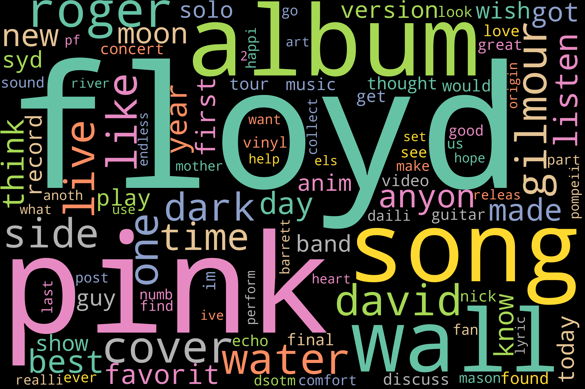

# Which Fanbase? 
A project exploring Natural Language Processing and Text Classification of Reddit posts from four popular band Subreddits.

                  

#### Overview
This project implemented natural language processing and machine learning models to classify posts from the subreddits of four popular twentieth century bands: The Grateful Dead, Phish, Pink Floyd, and the Beatles. 

#### Questions
- What topics are posted about in these four subreddits? What topics are similar across the subreddits and what is unique to each?
- When given a post from one of these four subreddits, which fanbase (or subreddit) did it come from?

# Data
The data used in this project was scraped from reddit using Reddit's Pushshift API.  In total, 160,000 posts were scraped, 40,000 from each subreddit.  This project used only the text of each post and the subreddit label.  30% of the data was set aside as a testing subset. 

# NLP Pipeline
#### Text Cleaning
The text of each post was cleaned with the following steps:
- Remove accents
- Get lowercase text
- Get rid of punctuation and stop words
- Tokenize, get the snowball stem of each word

#### Vectorization
A TF-IDF matrix was created with the tokenized word stems, taking the top 5,000 features of the total 33,000 features. 

# Exploratory Data Analysis
#### Word Frequency
I began by looking at the most frequent words used in each unique subreddit.

#### Non-negative Matrix Factorization
I reduced the feature matrix for each unique subreddit to 10 latent features and looked through the posts within each latent feature to put a name to each latent topic. 

Below is an example of several posts from a single latent feature. Looking through the posts, it is clear that there is a common theme here around buying and selling tickets:

                  

Looking through the posts that were grouped in each latent feature, I labeled the latent features as shown below:

As shown in the tables, there are overlapping trends across all subreddits, like the latent features focused around band name and specific band memebers.

There are also differences that highlight the unique attributes of each band.  
- Phish, the only one of these bands still touring today, whose following is based on live performance and tours and festivals, has latent features related to shows, ticket sales, and specific venus.
- The Grateful Dead, while not currently touring with its original members, but also infamous for live performance, has latent features related to specific shows and concerts from history, referenced by date. 
- The Beatles, famous for studio albums rather than live performance, has latent features related to specific albums as well as mention and discussion of albums in general.
- Pink Floyd, also famous for studio recorded albums, specifically concept albums, has latent features related to specific albums as well as covers, as fans also seem to be heavily discussing covers done of many of the popular songs and albums. 

# Modeling
My next task was trying to predict the subreddit when given any single post.  Four supervised machine learning models were implemented:
- Logistic Regression
- Multinomial Naive Bayes
- Random Forest Classifier  
- Gradient Boosting Classifier

A gridsearch was used with the latter two models to optimize hyperparameters.

The optimal model performances are shown below:

# Summary of Results
The best model was the Random Forest Classifier with the following metrics:
- Accuracy: 0.7813
- Weighted Average Precision: 0.7821
- Weighted Average Recall: 0.7814

The top feature importances are shown below:

# Next Steps
#### Take additional steps to improve model accuracy:
- Implement N-grams to try to pick up on more unique language context within each subreddit such as commonly used lyric and band member quotes
- Train a Neural Network

#### Apply the process to other applications:
- Classifying web content for similar content recommendations
- Classifying media posts, emails, survey responses for interpretation
